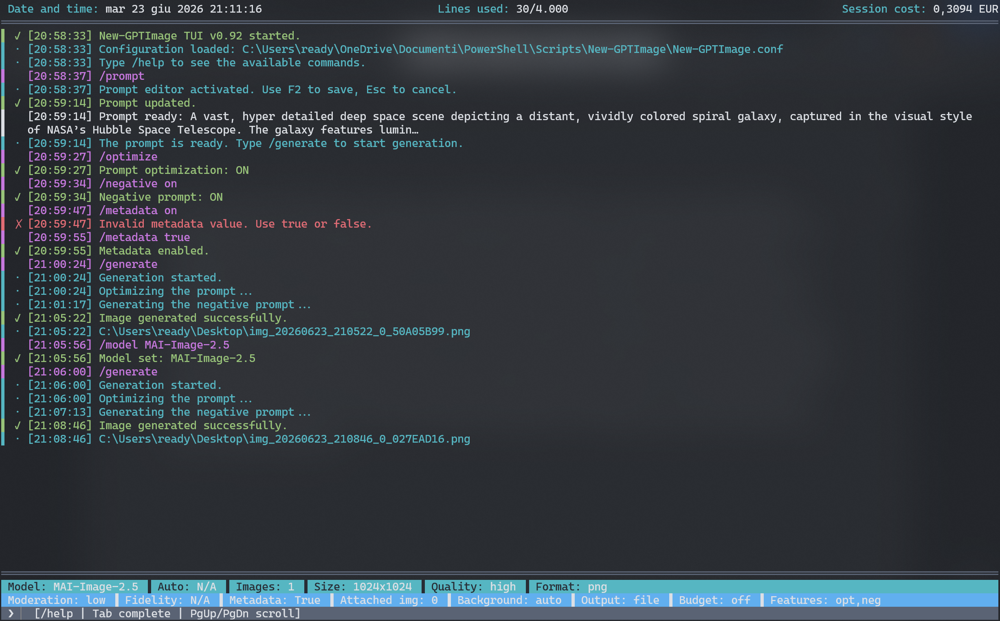
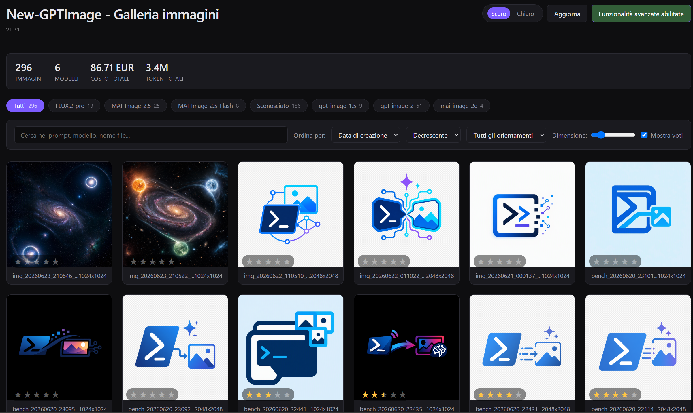
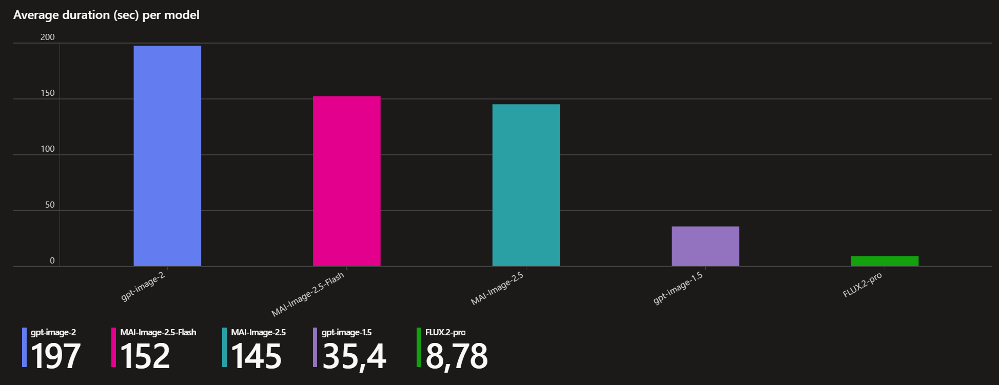

<p align="center">
  
</p>

# New-GPTImage

A complete command-line AI image generator for **Azure AI Foundry** / OpenAI, written
in PowerShell 7. Generate and edit images through diffusion and image-generation models
hosted on Azure, with cost tracking, analytics, an HTML gallery, an interactive
full-screen interface, multilingual output, and infrastructure provisioning — all from a
single self-contained script.

| Component | Version |
|-----------|---------|
| Script    | 5.92    |
| TUI (interactive interface) | 0.92 |
| Gallery (HTML gallery) | 1.71 |

> **License:** GNU General Public License v3.0 — see [LICENSE](LICENSE).
> Copyright (C) 2026 Andrea D'Orio.

---

## Table of contents

- [Overview](#overview)
- [Documentation](#documentation)
- [Key features](#key-features)
- [Requirements](#requirements)
- [Installation](#installation)
- [Configuration](#configuration)
  - [Configuration file structure](#configuration-file-structure)
  - [Model schemas](#model-schemas)
  - [API key encryption](#api-key-encryption)
- [Quick start](#quick-start)
- [Command reference](#command-reference)
  - [Generation parameters](#generation-parameters)
  - [Image editing](#image-editing)
  - [Model selection and benchmarking](#model-selection-and-benchmarking)
  - [Batch processing](#batch-processing)
  - [Text-model features](#text-model-features)
  - [Utility and management commands](#utility-and-management-commands)
- [The interactive interface (TUI)](#the-interactive-interface-tui)
- [Cost tracking and pricing](#cost-tracking-and-pricing)
- [Analytics](#analytics)
- [The HTML gallery](#the-html-gallery)
- [Telemetry and Workbook](#telemetry-and-workbook)
- [Infrastructure as Code (-IaC)](#infrastructure-as-code--iac)
- [Internationalization](#internationalization)
- [Output files](#output-files)
- [Privacy and security](#privacy-and-security)
- [Troubleshooting](#troubleshooting)
- [Contributing](#contributing)
- [License](#license)

---

## Overview

New-GPTImage is a single PowerShell script that turns Azure AI Foundry and OpenAI
image models into a polished, production-grade tool. It started as a simple
text-to-image generator and grew, across many development iterations, into a
multi-model platform with three independently versioned components: the **script**
itself, a full-screen **TUI**, and a rich **HTML gallery**.

The design philosophy is *zero external dependencies*: everything ships in one `.ps1`
file plus a JSON language pack. Image processing uses the .NET libraries built into
PowerShell, the gallery is self-contained HTML/JS, and the only optional external tool
is the Azure CLI, needed solely for the `-IaC` provisioning command.

---

## Documentation

In-depth guides for every part of the tool live in the [`docs/`](docs/) folder:

| Guide | Topic |
|-------|-------|
| [Setup](docs/setup.md) | Prerequisites, files, first-time configuration, infrastructure, verification. |
| [Configuration reference](docs/config.md) | Every field of `New-GPTImage.conf`, explained. |
| [Managing models](docs/models.md) | Add, edit and remove models; the three API schemas. |
| [Command-line reference](docs/cli.md) | All CLI parameters, grouped, with examples. |
| [Interactive interface (TUI)](docs/tui.md) | The full-screen interface, commands and themes. |
| [Benchmark mode](docs/bench.md) | Comparing models on time, cost and quality. |
| [HTML gallery](docs/gallery.md) | Browsing, comparing and rating generated images. |
| [Analytics](docs/analytics.md) | Textual cost/usage charts and CSV export. |
| [Telemetry, Workbook & IaC](docs/telemetry.md) | Azure telemetry, the Workbook, and provisioning. |
| [Cost management](docs/costs.md) | How costs are computed, tracked and capped. |
| [System utilities](docs/utilities.md) | Diagnostics, pricing tools, logging, self-test. |
| [The text model](docs/text-model.md) | Prompt optimization, negative prompts, storyboards, description. |

---

## Key features

- **Text-to-image generation** and **image-to-image editing** (edit / inpainting)
  across multiple configurable models.
- **Multi-model, multi-schema:** three different API schemas (`openai-images`,
  `mai-images`, `bfl-flux`) can coexist in the same configuration file, each with its
  own authentication mode (`api-key` or `bearer`).
- **Cost tracking** in USD and in your local currency, with automatic model-price
  updates from the Azure Retail Prices API and a daily currency-conversion refresh.
- **Automatic downscaling:** if a requested size exceeds a model's limits, it is
  reduced to the closest valid size (preserving aspect ratio) with a warning, instead
  of failing the request.
- **Automatic model selection** (`-Auto Cost|Quality|Time`) based on estimated cost,
  quality rating, or speed.
- **Benchmarking** (`-Bench`): the same prompt across several models, comparing time,
  cost, tokens, and output images, with CSV export.
- **Batch processing**, sequential or parallel.
- **Text-model features:** prompt optimization (`-OptimizePrompt`), negative-prompt
  generation (`-NegativePrompt`), image description / image-to-prompt
  (`-DescribeImage`), and **storyboard** generation (`-Storyboard`) for coherent
  multi-scene sequences.
- **Full-screen interactive interface (TUI)** with a prompt editor, runtime commands,
  color themes, and real-time generation.
- **HTML gallery** with a lightbox, mouse-wheel zoom and pan, search, filters,
  statistics, model comparison, and per-image ratings.
- **Optional telemetry** to Azure Application Insights, with a ready-to-use Workbook.
- **Infrastructure as Code** (`-IaC`): a wizard that provisions the Azure resources the
  script needs (AI Foundry, Application Insights) via the Azure CLI.
- **Full internationalization in 11 languages:** Italian, English, French, Spanish,
  Portuguese, German, Russian, Chinese, Japanese, Hindi, Arabic.
- **Privacy and security:** API keys encrypted at rest (DPAPI on Windows), optional and
  disableable prompt logging, and thorough input validation.

---

## Requirements

- **PowerShell 7.0 or later.** The script refuses to run on Windows PowerShell 5.1: the
  reliable UTF-8 handling required for multilingual support exists only from PowerShell
  7 onward. A `#requires -Version 7.0` directive enforces this with a clear message.
- An **Azure subscription** with access to Azure AI Foundry and at least one deployed
  image-generation model (for example, gpt-image-2).
- For image **editing** (edit / inpainting): **Windows** — this path uses the system
  graphics APIs. Generation, logging, and configuration work on Linux and macOS too.
- Optional: **Azure CLI** (`az`) for the `-IaC` command; a Chromium-based browser
  (Chrome / Edge) for the gallery's advanced features (ratings export via the File
  System Access API).

Development and reference testing are done on Windows 11 (ARM64, Snapdragon X) with
PowerShell 7.6.

---

## Installation

1. Clone the repository:
   ```
   git clone https://github.com/readytogo100/New-GPTImage.git
   cd New-GPTImage
   ```
2. Generate an initial configuration:
   ```powershell
   ./New-GPTImage.ps1 -Setup
   ```
   This creates a default `New-GPTImage.conf`. Alternatively, copy
   `New-GPTImage.conf.example` to `New-GPTImage.conf` and edit it.
3. Fill in your endpoints, deployment names, and API keys in the `.conf`. On first run,
   any keys entered in plaintext are automatically encrypted (DPAPI on Windows).
4. Verify the configuration:
   ```powershell
   ./New-GPTImage.ps1 -ModelList
   ./New-GPTImage.ps1 -CheckModels
   ```

> **Security:** never commit your `New-GPTImage.conf` — it contains your keys. The
> bundled `.gitignore` already excludes it.

---

## Configuration

All behavior is driven by `New-GPTImage.conf`, a JSON file in the script's directory.
It holds global defaults, a `models` section, a `textModel` section, and several
subsystems (privacy, telemetry, pricing update, TUI themes, auto-update).

### Configuration file structure

Top-level defaults (selected):

| Key | Meaning | Example |
|-----|---------|---------|
| `defaultModel` | Model used when `-Model` is omitted | `gpt-image-2` |
| `defaultSize` | Default output size | `1024x1024` |
| `defaultQuality` | Default quality (`low`/`medium`/`high`) | `high` |
| `defaultFormat` | Default image format (`png`/`jpg`/`webp`) | `png` |
| `defaultModeration` | Default content moderation level | `low` |
| `defaultBackground` | Default background mode | `auto` |
| `defaultOutputFolder` | Where images are written | `C:/Users/You/Pictures` |
| `defaultCurrency` | Local currency for cost display | `EUR` |
| `language` | Default UI language | `it` |
| `maxRetries` | API retry budget | `5` |
| `batchThreads` | Default parallelism for batch (capped at 5) | `1` |
| `requestTimeoutMinutes` | Per-request timeout | `10` |
| `fileNameTemplate` | Output filename pattern | `img_{timestamp}_{index}_{promptHash}` |

Each entry under `models` describes one model: `endpoint`, `editEndpoint`,
`deployment`, `apiKey` (encrypted), `apiSchema`, `authMode`, capability flags
(`supportsEdit`, `supportsInpainting`, `supportsInputFidelity`, `supportsBackground`),
quality/speed ratings, a `pricing` block (meters), a `pricingMapping` block (used for
automatic price updates), and an `operationalParams` block describing the model's size
and image constraints.

The `textModel` section configures the model used for prompt optimization, negative
prompts, storyboards, and image description: `endpoint`, `apiKey`, `model`, `authMode`,
`maxCompletionTokens`, `reasoningEffort`, `timeoutSec`, and the two manual pricing
fields `inputUsdPerMillion` / `outputUsdPerMillion`.

### Model schemas

The script speaks three API schemas, selected per model via `apiSchema`:

- **`openai-images`** — Azure OpenAI GPT-Image models (e.g. gpt-image-2,
  gpt-image-1.5). Pricing uses six meters (input/cached-input/output for text and
  image). Size constraints are geometric (max side, divisibility, aspect-ratio range).
- **`mai-images`** — Microsoft MAI-Image models (e.g. MAI-Image-2.5, 2.5-Flash).
  Pricing uses two meters (input / output). Size constraints require a minimum side of
  768 px and a maximum area of 1,048,576 px (equivalent to 1024x1024).
- **`bfl-flux`** — Black Forest Labs FLUX models. Pricing uses three per-megapixel
  meters (first / additional / reference megapixel). Default authentication is
  `bearer`.

A model whose requested size violates its schema constraints is automatically
downscaled to the nearest valid size; the script only blocks when no valid reduction
exists (for example, an aspect ratio that cannot fit the model's limits).

### Supported models

The default configuration ships with six models across the three schemas. You can add,
edit or remove models at any time — see the [model management guide](docs/models.md).

| Model | API schema | Edit support |
|-------|-----------|--------------|
| `gpt-image-2` | `openai-images` | Yes |
| `gpt-image-1.5` | `openai-images` | Yes |
| `MAI-Image-2e` | `mai-images` | No |
| `MAI-Image-2.5` | `mai-images` | Yes |
| `MAI-Image-2.5-Flash` | `mai-images` | Yes |
| `FLUX.2-pro` | `bfl-flux` | Yes |

A separate **text / multimodal model** (the `textModel` section) powers the prompt
features — optimization, negative prompts, storyboards and image description. See the
[text model guide](docs/text-model.md).

### API key encryption

On Windows, keys are encrypted with **DPAPI** and stored with an `enc:` prefix. The
encryption is tied to the current user account, so the `.conf` cannot be decrypted on
another machine or by another user. If DPAPI is unavailable (non-Windows), keys may be
Base64-obfuscated with a `b64:` prefix and a warning. On first run, any key found in
plaintext is encrypted automatically.

---

## Quick start

Simple generation:
```powershell
./New-GPTImage.ps1 -Prompt "A lighthouse on a cliff at sunset, watercolor style" -Model gpt-image-2
```

<p align="center">
  
</p>

With size, quality, and format:
```powershell
./New-GPTImage.ps1 -Prompt "Photorealistic portrait" -Size "1024x1536" -Quality high -Format png -Model gpt-image-1.5
```

Editing an existing image (image-to-image):
```powershell
./New-GPTImage.ps1 -Prompt "Add a starry sky" -InputImages "C:\photos\landscape.jpg" -Model MAI-Image-2.5
```

Prompt optimization plus a generated negative prompt:
```powershell
./New-GPTImage.ps1 -Prompt "cat on a sofa" -OptimizePrompt -NegativePrompt
```

Automatically pick the cheapest model:
```powershell
./New-GPTImage.ps1 -Prompt "minimalist logo" -Auto Cost
```

Benchmark several models and export the comparison:
```powershell
./New-GPTImage.ps1 -Prompt "night skyline" -Bench gpt-image-2,MAI-Image-2.5,FLUX.2-pro -BenchExport bench.csv
```

Launch the interactive interface:
```powershell
./New-GPTImage.ps1 -TUI
```

Gallery, cost analytics, and help:
```powershell
./New-GPTImage.ps1 -Gallery
./New-GPTImage.ps1 -Analytics EUR
./New-GPTImage.ps1 -Help
```

---

## Command reference

This is a topical reference. For the complete, always-current parameter list with
per-parameter examples, run `./New-GPTImage.ps1 -Help`.

### Generation parameters

| Parameter | Default | Description |
|-----------|---------|-------------|
| `-Prompt <text>` | — | The generation prompt. Minimum 5 characters. |
| `-PromptFile <path>` | — | Read the prompt from a `.txt`/`.md` file (overrides `-Prompt`). |
| `-Model <name>` | `defaultModel` | Logical model name; must exist under `models` in the `.conf`. |
| `-NImages <n>` | `1` | Number of images per request (validated range 1–100; typical max 10). |
| `-Size <WxH>` | `defaultSize` | Output size, e.g. `1024x1024`, `1536x1024`. Auto-downscaled if too large. |
| `-Quality <level>` | `defaultQuality` | `low`, `medium`, or `high`. |
| `-Format <fmt>` | `defaultFormat` | `png`, `jpg`, or `webp`. |
| `-Moderation <level>` | `defaultModeration` | Content moderation (`openai-images` schema only). |
| `-Background <mode>` | `defaultBackground` | `auto`, `opaque`, or `transparent`. |
| `-OutputFolder <path>` | `defaultOutputFolder` | Destination directory. |
| `-OutputMode <mode>` | `file` | `file` or `base64`. |
| `-Metadata <bool>` | from `.conf` | Write a `.json` sidecar next to each image. |
| `-Verbosity <level>` | `verbose` | `verbose`, `normal`, `silent`, `ultrasilent`. |
| `-DryRun` | off | Validate and estimate without calling the API. |
| `-Budget <amount>` | — | Abort if the estimated cost (+20% margin) exceeds the budget. Accepts comma or dot decimals. |

### Image editing

Image-to-image editing is triggered by supplying one or more input images. Editing
requires Windows and a model whose `supportsEdit` is true.

| Parameter | Description |
|-----------|-------------|
| `-InputImages <paths>` | One or more source images for edit / inpainting. Max 20 MB each. |
| `-Mask <path>` | Mask image for inpainting (where supported). |
| `-InputFidelity <value>` | Fidelity to the input image (where supported). |

Input images are validated by magic bytes, converted to RGB as needed, and resized to
the model's maximum area to avoid timeouts. If a feature is not actually supported by
the model, the script retries without it rather than failing.

### Model selection and benchmarking

| Parameter | Description |
|-----------|-------------|
| `-Auto Cost\|Quality\|Time` | Pick the best model by estimated cost, quality rating, or speed. |
| `-Bench <models>` | Run the same prompt on a comma-separated list of models and compare. |
| `-BenchExport <path>` | Export benchmark results to CSV (culture-aware decimals). |
| `-Overwrite` | Allow overwriting an existing export file. |

`-Auto Cost` estimates the real USD cost of one generation per model (using the same
cost engine as the live `[COST]` line) so models with different pricing schemes become
directly comparable. `-Auto Quality` can blend an Arena score with gallery votes when a
model has enough ratings. Benchmarking respects the `-Budget` guardrail, estimating the
total cost across all prompt × model combinations before generating.

### Batch processing

| Parameter | Description |
|-----------|-------------|
| `-Batch <path>` | A `.batch` file (JSON array) describing multiple requests. |
| `-Threads <n>` | Parallel workers (0 = use `batchThreads` from config; capped at 5). |

Each batch item is a JSON object that may contain `prompt`, `size`, `quality`,
`format`, `n`, `inputImages`, and `mask`; missing fields fall back to the global
parameters. A batch is limited to 99 requests per file; the report uses zero-padded
numbering and includes per-request cost plus a batch total.

### Text-model features

These features use the `textModel` configured in the `.conf` and are tracked
separately for cost.

| Parameter | Description |
|-----------|-------------|
| `-OptimizePrompt` | Rewrite the prompt via the text model (shows before/after; confirm or `-Force`). |
| `-NegativePrompt` | Generate a negative prompt. Since gpt-image/MAI lack a native field, it is soft-injected ("avoid: ...") into the positive prompt. |
| `-Storyboard` | Decompose a text into N coherent scenes using a shared "style bible". |
| `-SequenceImages <n>` | Number of storyboard scenes (2–20; default 5). Output is numbered `story_01..NN`. |
| `-DescribeImage <path>` | Analyze an image and produce a prompt (image-to-prompt), in the script's language. Requires a multimodal text model. |

### Utility and management commands

| Parameter | Description |
|-----------|-------------|
| `-Setup` | Create a default configuration file. |
| `-Gallery` | Generate the HTML gallery. |
| `-Analytics [EUR\|USD\|Token]` | Print textual cost/usage charts. |
| `-AddModel` / `-EditModel` / `-RemoveModel` | Interactive model-management wizards. |
| `-ModelList` | Show configured models and their status. |
| `-CheckModels` | Network reachability check for model endpoints. |
| `-ModelPrice [Force]` | Update model prices from the Azure Retail Prices API. |
| `-PricingDiscovery <keyword>` | Explore the Retail API price catalog. |
| `-IaC` | Azure infrastructure provisioning wizard. |
| `-Lang <code>` | UI language (`it`, `en`, `fr`, `es`, `pt`, `de`, `ru`, `zh`, `ja`, `hi`, `ar`). |
| `-DecryptLog` | Decrypt an encrypted log file. |
| `-SelfTest [-Simulate\|-Real\|-AllTest]` | Run the built-in test suite. |
| `-Version` | Print the current version and exit. |
| `-Help [Example]` | Show help, optionally with per-parameter examples. |
| `-NoTelemetry` | Disable telemetry for this run only. |

---

## The interactive interface (TUI)

`-TUI` launches a full-screen terminal interface. It shows a header with the current
model and parameters and a live clock, a scrollable message body with word wrap, two
status bars (one of which lists active features), and a command line.

<p align="center">
  
</p>

The TUI is driven by slash commands. The prompt and all generation parameters can be
set at runtime, then `/generate` runs a real in-process generation with a live progress
bar, budget guardrail, and cost logging.

| Command | Purpose |
|---------|---------|
| `/prompt`, `/promptfile` | Set the prompt (inline or from a file; opens the full-screen editor). |
| `/model`, `/size`, `/quality`, `/format`, `/nimages` | Set generation parameters. |
| `/moderation`, `/background`, `/inputfidelity`, `/mask`, `/inputimages` | Set edit-related parameters. |
| `/optimize`, `/negative`, `/storyboard`, `/sequenceimages` | Toggle/configure text-model features. |
| `/auto` | Set the automatic model-selection strategy. |
| `/outputfolder`, `/outputmode`, `/metadata` | Set output options. |
| `/budget <amount\|off>` | Set or clear the spend guardrail. |
| `/theme` | Switch color theme (nine built-in themes). |
| `/reload` | Reload the configuration in place, without closing the TUI. |
| `/generate` | Run the generation. |
| `/reset`, `/clear`, `/help`, `/exit` | Reset parameters, clear the screen, show help, quit. |

The prompt editor supports word wrap, multi-line cursor movement, saving to file, and
copy with Ctrl+C; the message body scrolls with Ctrl+Home / Ctrl+End. Rendering uses
Synchronized Output to avoid flicker, updating only the progress bar during generation.

---

## Cost tracking and pricing

Every generation logs a `[COST]` line with the cost in USD and in your local currency.
The `.cost` file keeps a daily aggregate, and text-model operations log their own
`[COST]` lines with real token counts.

Model prices are updated automatically from the **Azure Retail Prices API** through a
four-phase pipeline: an exact lookup, a relaxed lookup, HTML scraping of the official
pricing page as a fallback, and a discovery mode that writes
`New-GPTImage.pricing-discovery.json` with candidate entries when a model cannot be
matched. Prices are normalized regardless of the unit of measure and converted to your
local currency using a daily exchange rate (sourced from the ECB via frankfurter.app).

Text-model pricing is **manual**: set `inputUsdPerMillion` and `outputUsdPerMillion` in
the `textModel` section from your model's pricing page. If left at zero, the real token
counts are still logged but no monetary cost is computed.

The `-Budget` guardrail estimates the cost before generating and aborts if the
conservative estimate (+20% margin) exceeds your limit.

---

## Analytics

`-Analytics` prints ten textual charts (laid out in five rows of two) covering cost and
usage: cost over time (daily and monthly), cost per model, average cost per image,
token usage, and — in charts 9 and 10 — the text-model cost by month and by function
(optimize / negative / storyboard / describe). Pass `EUR`, `USD`, or `Token` to choose
the unit; with no argument it uses your `defaultCurrency`.

---

## The HTML gallery

`-Gallery` builds a self-contained `gallery.html` from the images in your output
folder. It includes a lightbox with mouse-wheel zoom (0.25x to 8x) and pan, a zoom
indicator, light/dark themes, sorting by date / name / size, search and filters,
extended per-image info (dimensions, aspect ratio, DPI, color depth, transparency),
model-comparison views, and per-image ratings.

<p align="center">
  
</p>

Ratings are exported to `gallery_ratings.json` in the images folder via the browser's
File System Access API (Chrome/Edge), which `-Auto Quality` can then read. The gallery
displays only your configured currency, and its version is shown in the regeneration
log line. Model attribution in ratings requires generating with `-Metadata True`.

---

## Telemetry and Workbook

The script can send generation telemetry to **Azure Application Insights** (configurable
in the `telemetry` section, with a `source` property of cli/tui/batch/benchmark).
Telemetry is optional and can be disabled per run with `-NoTelemetry`. A companion Azure
Monitor **Workbook** with formatted, time-series charts can be provisioned to visualize
the data; charts populate as you generate images.

<p align="center">
  
</p>


> The connection string is a sensitive credential — treat it like a key and keep it out
> of version control.

---

## Infrastructure as Code (-IaC)

`-IaC` is a wizard that provisions the Azure infrastructure the script needs, via the
**Azure CLI** (`az`). It generates a Bicep template (AI Foundry resource and project,
Application Insights / Log Analytics) and applies it with `az deployment`. Creating the
infrastructure is the primary goal; deploying the models themselves is optional, since
model availability depends on region, subscription quotas, and other factors. Access to
the deployed models uses API keys, consistent with the rest of the script.

Relevant parameters include `-IaCMode` (`generate` / `dry-run` / `execute`),
`-IaCResourceGroup`, `-IaCRegion`, `-IaCFoundryName`, `-IaCProjectName`, and the
optional model-deployment switches (`-IaCDeployModel`, `-IaCModelName`,
`-IaCModelVersion`, `-IaCModelSku`, `-IaCModelCapacity`), plus teardown options.

> `-IaC` creates real, billable cloud resources. Review what it will create (use the
> dry-run mode) before executing.

---

## Internationalization

All user-facing strings are externalized into `New-GPTImage.lang`, a JSON language pack
covering **11 languages**: Italian, English, French, Spanish, Portuguese, German,
Russian, Chinese, Japanese, Hindi, and Arabic (including right-to-left rendering for
Arabic). Strings are resolved at runtime through a `T()` function with a cascade:
current language → English fallback → key name. Choose the language with `-Lang` or the
`language` setting in the `.conf`. Log-level tags (`[INFO]`, `[WARN]`, `[ERROR]`,
`[TIME]`, `[COST]`, `[PROMPT]`) intentionally remain in English.

---

## Output files

The script and its components produce the following files (all excluded by the bundled
`.gitignore`):

| File | Content |
|------|---------|
| `New-GPTImage.log` | Application log (may contain prompts if prompt logging is on). |
| `New-GPTImage.stat` | Timing telemetry used by the kNN time estimator. |
| `New-GPTImage.cost` | Daily cost aggregate. |
| `New-GPTImage.pricing-discovery.json` | Candidate pricing entries when a model is not matched. |
| `gallery.html`, `gallery-data.js` | The generated gallery. |
| `gallery_ratings.json` | Per-model rating aggregates exported by the gallery. |
| `img_*.{png,jpg,webp,json}` | Generated images and metadata sidecars. |
| `story_*.{png,jpg,webp,json}` | Storyboard sequences. |
| `analytics*.txt` | Exported analytics. |

---

## Privacy and security

- **API keys** are encrypted at rest (DPAPI on Windows) and never written to logs in
  plaintext. Do not share or commit your `New-GPTImage.conf`.
- **Prompt logging** is optional and off by default. When enabled, prompts can be
  written to the log (optionally Base64-obfuscated) at a file-only `[PROMPT]` level,
  controlled by the `privacy` section (`imagePrompts` / `supportPrompts`).
- **Telemetry** is optional and disableable; its connection string is sensitive.
- **Costs:** the script calls metered, billable services. Use `-Budget` to cap spend.

See [SECURITY.md](SECURITY.md) for how to report a vulnerability.

---

## Troubleshooting

- **"This script requires PowerShell 7."** You are running Windows PowerShell 5.1.
  Install PowerShell 7+ and run with `pwsh`.
- **A size is rejected as too large.** It should be downscaled automatically; if it is
  blocked, the requested aspect ratio cannot fit the model's limits — try a size whose
  ratio matches the model's constraints.
- **Editing fails or is unavailable.** Image editing requires Windows and a model with
  `supportsEdit` enabled. Check `-ModelList`.
- **A 404 in edit mode.** Verify the `editEndpoint` domain and API version for that
  model in the `.conf`.
- **Cost shows as zero for text-model operations.** Set `inputUsdPerMillion` /
  `outputUsdPerMillion` in the `textModel` section.
- **`-PricingDiscovery` returns nothing for a model.** The Azure Retail API does not
  catalog some image models under obvious product names; the script falls back to HTML
  scraping of the pricing page.
- **Gallery ratings don't persist.** Ratings export requires Chrome/Edge (File System
  Access API) and the model attribution requires `-Metadata True`.

For anything else, run with `-Verbosity verbose` and inspect the log.

---

## Contributing

Contributions are welcome. Please read [CONTRIBUTING.md](CONTRIBUTING.md) for the
project's conventions: PowerShell 7, English code comments, the baseline
integrity check after every change, and full 11-language coverage in the language pack.
See [changelog.md](changelog.md) for the complete version history (0.1 → 5.92).

---

## License

Distributed under the terms of the **GNU General Public License v3.0**. This means
anyone may use, study, modify, and redistribute the software, but modified versions that
are redistributed must remain under the same license. See [LICENSE](LICENSE) for the
full text.

Copyright (C) 2026 Andrea D'Orio.
